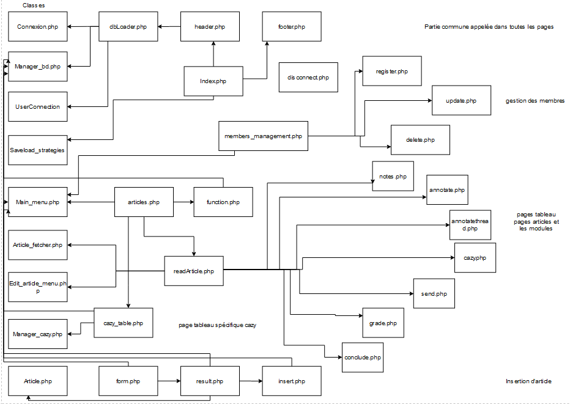
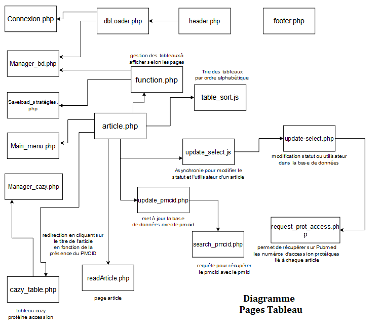
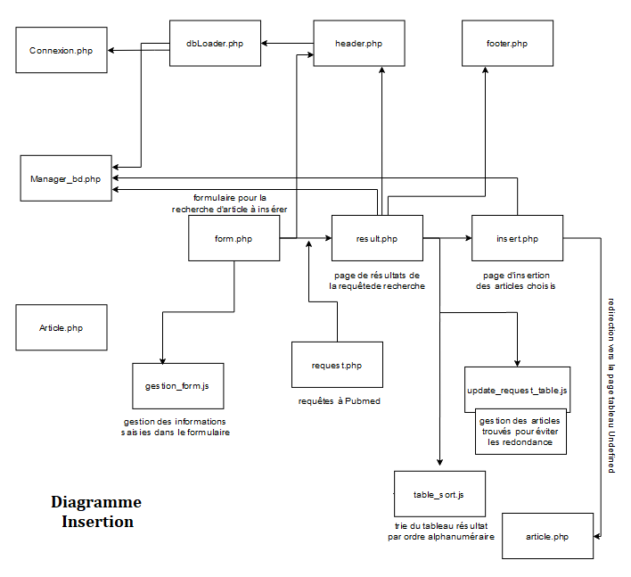
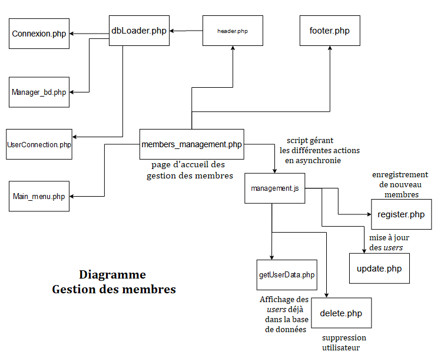
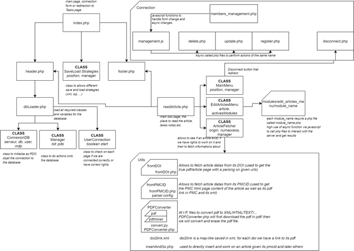
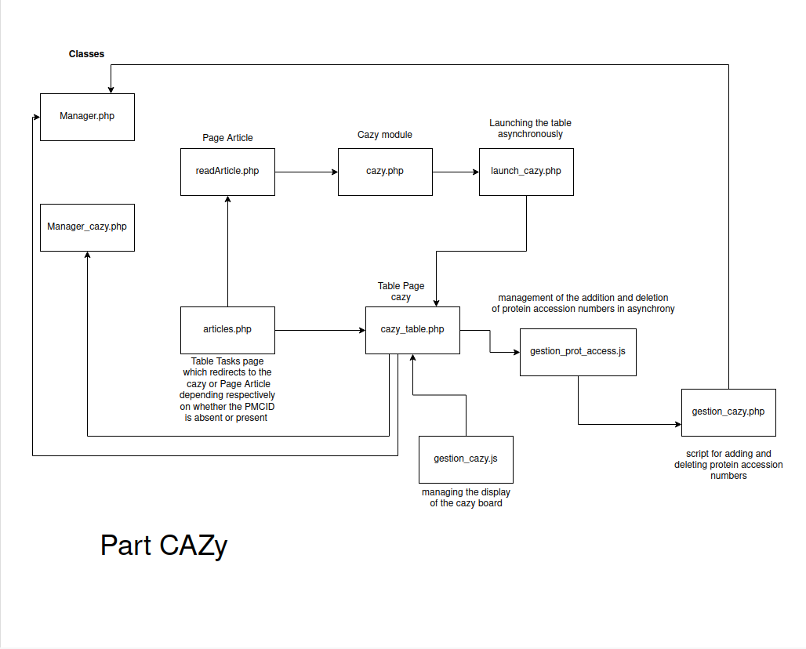

# Bibliography-Tools

 Website to improve collaborative management of scientific oversight: extraction, storage and access to publications in teams
## Context

A problem in research is the considerable amount of time spent reading new articles, moving information forward, sharing with collaborators and others, storing data, making it accessible, etc. The aim of this project is to solve this problem by proposing an easy-to-use website solution that will allow us to search for articles, store them, work and share, keep important information visible and more, allowing everyone to use such a tool and to use tools that are useful for them thanks to a high level of modularity.

This project is a joint project between the AFMB laboratory (Aix-Marseille Universities, Luminy Campus) and the BIAM Institute of the CEA in Cadarache (ST-Paul Lez Durance). We are two people working on the project: TigiGLN](https://github.com/TigiGln/Biblio) student in first year of master bioinformatics at Luminy for AFMB and [Eddy IKHLEF (Moka)](https://github.com/m-o-k-a) student in L3 computer science at Luminy for CEA.
Our collaborative git repository: (https://github.com/TigiGln/Projet_stage)

## Requirement

-  PHP 7.0 or above
- MySql Server Database (use of the given database)*, **
\* If you want to use another sql server, you need to edit a file called class_connexion.php, line 32.
\*\* The only user that exist on the given database is: username=Admin, email=admin@root.com, password=root, profile=expert
- Web Server (Apache)
- no IE, Edge Legacy or IE Legacy on edge (Bootstrap 5.0 functionnality will not fully work)
-  Usage of [pdf2htmlEX](https://github.com/coolwanglu/pdf2htmlEX) (.exe and sources included for window, have yet to implement the equivalent for linux/macOS)
- First, implement the database with the schema_biblio.sql file in the annexes folder
- To launch the tool you need to modify line 27 of dbLoader.php in the views folder to put your database login details
$_SESSION['connexiondb'] = new ConnexionDB("localhost", "name_database_mysql", "3306", "id_user_mysql", "password_mysql");
For those who don't want it with the parameters for the Cazy database.
modification:
-> For result.php in the insertion folder
- Deletion line 14
- Deletion line 21 and 22
- Modification line 148 -> replace ($list_num_access_already_present by $list_num_access_bd) 
-> Removal of the Manager_cazy class in POO and the cazy module.
For the function.php file in the tables folder
- delete else line 126 to 129


## general diagram


## Hierarchy (Vanilla)
```
.
├── annexes/                # Annexes files, contains the base database file to use
├── css/                    # Css general files
├── pdf/                    # Folder that save pdf files locally
├── pictures/               # Pictures general folder
├── views/                  # General views files (header, footer, dbLoader)
├── connection/             # Folder of views and Model related to connection, user management
│   ├── delete.php          # Model to delete a user (call is async)
│   ├── disconnect.php      # Model to disconnect the user
│   ├── getUserData.php     # Model to get user data (call is async)
│   ├── register.php        # Model to register a user (call is async)
│   ├── update.php          # Model to update a user (call is async)
│   ├── members_manageme... # View for the users management (edit informations, add/delete/update a user)
│   └── management.js       # JavaScript functions related to members_management.php
├── insertion/              # Folder of views and Model related to inserting articles
│   ├── check_bdd.php       # Check connection (Deprecated)
│   ├── form.php            # View of the insertion form
│   ├── gestion_form.js     # JavaScript code for form.php
│   ├── insert.php          # Insert selected to database
│   ├── request.php         # Go fetch the article
│   ├── result.php          # Similar to request.php plus will show the article table
│   └── update_request_t... # JavaScript to update table
├── tables/                 # Folder of views and Model related to table
│   ├── articles.php        # View of the table of articles 
│   ├── function.php        # Model to handle which table status to display and built it
│   ├── update.php          # Update table 
│   ├── update2.php         # Update on user interaction (async)
│   ├── sort_status.js      # JavaScript to sort status
│   └── table_sort.js       # JavaScript to sort table
├── tools/                  # Folder related to tools models (readArticle, ...)
│   ├── readArticle.php # The main view used to read and work on articles
│   └── scripts/        # All scripts related to tools views
├── modules/                # Folder related to modules views and models
│   ├── edit_article_menu/  # Folder related to edit article menu (used in readArticle)
|   │   ├── xxx             # Folder related to view and model of a module called xxx
|   │	|  ├── xxx.php      # Anchor view page of the module (only html content)
|   │	|  ├── yyy.css      # Style of the module 
|   │	|  ├── zzz-TYPE1.js # Javascript Function a type (Interaction, WISIWYG, ...)
|   │	|  ├── zzz-TYPE2.js # Javascript Function of another type (Interaction, WISIWYG, ...)
|   │	|  ├── ...
|   │	|  ├── asyncAct.php # Async Server-side script/functions to performs
|   │   |  └── ...     
|   │   └── ...             
│   └── ...                 # You can add other modules family to add features
├── utils/                  # Folder related to utils scripts
│   ├── fromDOI/   			# Folder related models for fetching data online from DOI  
│   |	└── fromDOI.php     # Model to fetch data online from DOI and work on them  
│   ├── fromPMCID/   		# Folder related models for fetching data online from PMCID 
│   |	|── fromPMCID.php   # Model to fetch data online from PMCID and work on them  
│   |	└── parser.config   # Parser to edit the html received from PMC 
│   ├── PDFConverter/  		# Folder related models for convert pdf files  
│   ├── addPDF.php  	    # File to save pdf file and its link to an xml file     
│   ├── doi2link.php  	    # File to save the url link of a doi in an xml file  
│   ├── insertAndGo.php  	# File to insert a new article and directly work on it      
│   └── pdfDownloader.php   # File to download PDF files from url
├── POO/                    # Folder related to main objets
|   ├── class_article.php   # Object Model of Articles
|   ├── class_article_fe... # Object To fetch datas from a given Article
|   ├── class_connexion.php # Object To Start a connection to a database (POD Object)
|   ├── class_edit_artic... # Objet to build the menu "edit article menu" used in readArticle
|   ├── class_gestion_bd... # Object to manage the database connection
|   ├── class_main_menu.php # Objet to build the main menu
|   ├── class_manager_bd... # Objet to manage the interaction with database
|   ├── class_saveload_s... # Object to handle different save and load strategies (database and xml)
|   └── class_userConect... #  Object to handle user session and cookie 
├── index.php               # Anchor page, view of the connection
├── .htaccess
├── LICENSE                 # Github File
├── .gitattributes          # Github File
└── README.md               # Github File
```
## Common part:

When one arrives on the interface, one starts with a login page. After checking the user's identity (table user), he/she will be able to navigate between the pages of the interface thanks to a menu, initially reduced on the left. There are eight pages, with two specific pages (Insertion and Members Management) and six table pages with the same structure - access to the minimum essential information of the articles - but varying according to the status of the article and its assignment to a user. These table pages give access to an article page which displays the full text of the article, if it is freely available, so that it can be studied in greater depth by the user. On this article page, there are modules for annotating our article text, for taking notes, for evaluating the quality of the article, etc. 

## The statute

Status is a key concept in this tool. Four statuses have been defined depending on the state of readability of the article. To begin with, articles will be inserted with the status Undefined, as they have not yet been subject to human expertise to determine their relevance to our field of interest. The user will then have two options: either it is relevant and its status becomes Tasks; or it is not, and we transfer our article to the Rejected list. An article to be processed is read and annotated, and when the user has finished, it changes its status to processed or finished (Processed).

## Users

The notion of user intervenes at two levels, to access the tool and to be assigned to each article. 
Indeed, the ownership of an article is essential to avoid double curation, which would waste time and generate competing accesses to the annotation of the article. This conflict management has therefore been resolved by assigning a single user to each article. However, the user has the possibility of passing on an article to a more expert/available colleague. This concept of user assignment will make it possible to make a second filter in the various table pages.

##Table page



These pages are composed of a table where each line allows the visualisation of the important information of an article, in order to decide on its fate. These information/columns thus present: the accession number of the article (PMID), the title, the first and last author. Hovering features have been implemented to access the full abstract of the article (title hover), as well as the full list of authors and the journal/date (first and last author hover). This ergonomics will be present on all the table pages as well as in the search results on the insertion page. Finally, drop-down lists allow you to modify the status and the user. 

#### These pages are:
Undefined (visualization of its undefined articles)
Tasks (visualization of its articles in process or to be processed)
Undefined members (display of the undefined articles of others)
members tasks (view the articles being processed by other users)
processed (view all processed items)
rejected (view all rejected items)

## Insertion page



On this page you will find a form allowing you to transmit keywords to the server to make a request to the NCBI to search for the associated article(s) and retrieve the various relevant information. It is also possible to transmit a file with PMIDs (formatted one by one).

formatted one per line). We are then redirected to a table with a similar structure as the article tables with the accession number, title, first and last author and a last column with a checkbox to select the article to be inserted in our database. Hovering over the title allows us to view the abstract and hovering over the two authors gives us all the authors of the publication, the journal and the year of publication. After choosing the article(s) to be inserted, the insert button unlocks and redirects us directly to the table page, whose status is undefined.

## Members managements



This page is used for user management and differs depending on whether you are an expert or an assistant. An assistant will only be able to change their password, whereas an expert will be able to add members, change user information or delete users.

## Article page



This page, which was largely created by Eddy, the co-developer of the tool, gives us access to the full text of the article retrieved either through the PMCID in Pubmed, the html version or the pdf version if it is free. On this page we also see a menu of different modules allowing us to interact either with the text directly or to add additional information to the database as we curate. All modules are launched asynchronously to avoid slow loading of the article. 

## Cazy modules



The cazy module can be accessed in two different ways depending on whether the full text of the article is accessible through the PMCID. If the PMC is present, the cazy module is integrated in the set of modules of the Article page, otherwise the module opens in an annex page and the curator will have to use another tool to do his curation.
This module represents a table of protein access numbers that will allow to retrieve the corresponding entries in the CAZy database and to make checks to determine if all the information on the document and the function associated with the entry. Thus there will be links to Cazy to make the necessary changes to ensure that a document linked to accession numbers is properly integrated into the Cazy database and that the data in the entry is up to date. 
It will also be possible to add accession numbers that are not linked to the document despite their undeniable presence during the curation process.
The diagram above shows the layout of the scripts to manage all these features.  

## helpers
### About modules
>Terminology used in the existing vanilla modules are:
>module-INTERACTIONS : For functions related to interaction with the server
>module-WYSIWYG : For functions related to interaction with a WYSWIYG 

Modules relies **exclusively** on async call from front-end (JavaScript) to back-end (PHP). A simple usage is available below:
Let a module called template from edit_artice_menu (therefore inside module/edit_article_menu/template/)
Folder hierarchy can be:
```
./modules/edit_article_menu/
├── template/
│   ├── template.php        # Anchor view page of the module (only html content)
│   ├── template.css        # Css of the module
│   ├── template-INTERA...  # javaScript file with functions (async request to server)
|   └── getData.php         # Model to fetch data from database (call is async) 
└── README.md               # Github File
``` 

Let template-INTERACTIONS be:
```javascript
//...
//parameter id, optionnal if server request does not require parameters, we can also use many others parameters depending of what we want
function  getData(id) {
	//...
	/* Prepare request */
	//Prepare url
	let  url = "../modules/edit_article_menu/template/action.php";
	//Prepare parameters, optionnal if server request does not require parameters
	let  params = "value="+id;
	/* Fires request */
	var  http = new  XMLHttpRequest();
	//Open as GET, http.open("GET", url, true); if no parameters, http.open("POST", url, true); if you want a POST request
	http.open("GET", url+"?"+params, true);
	http.setRequestHeader("Content-Type", "application/x-www-form-urlencoded");
	//if POST request with parameters, do http.send(params);
	http.send(null);
	/* Handle request results */
	http.onreadystatechange = function() {
		//readyState 4 is DONE
		if (http.readyState === 4) {
			//Status 200 is OK, success
			if (http.status === 200) {
				//..
				let  data = JSON.parse(this.response); //
				//let data = this.response if you don't return a JSON from PHP
				//actions to do
				//.. 
			} 
			//if we got something else than 200 (we can also parse by checking other status code to manage many cases)
			else { 
			/..
			//Example of feedback to give to the page
			document.querySelector("#info").innerHTML = '<div class="alert alert-danger" role="alert">An error occured. Please reload.</div>';
			/..
			}
		}
	}
}  
//This is to use parameters of the page, let say we only have a parameter called id
let queryString = window.location.search; 
let urlParams = new URLSearchParams(queryString);
getData(urlParams.get('id'));
```

Let getData.php be:
```php
<?php
ob_start(); //To not echo header in the response
include('../views/header.php');
ob_end_clean(); //To not echo header in the response
?>
<?php
	if(!isset($_GET("valeur"))) { http_response_code(400); } //Bad request
	else {
		//...
		$res = //response data fetched
		if(!empty($res)) { //check if fetched isn't empty
		http_response_code(200); //Status code OK
		echo json_encode($res); //or just echo $res if no need of JSON
	} else {
		http_response_code(500); //Status code server error
	}
}
?>
```
To sum up:
1. edit_articles_menu will load modules and load template module by doing file_gets_content(path/template/template.php)
2. template.php page has javascriptwe wrote getData(urlParams.get('id')); so it will be called
3. getData will do an async request to getData.php with parameters value=id
4. getData.php process and return us a status code and a result if it was a success
5. we handle the status code from javascript function

### About utils/fromPMCID parser
fromPMCID can fetch XML content of the article on pubmedcentral, Nevertheless we should rather use the concrete HTML when showing HTML article content. This way we can keep the HTML hierarchy from PMC and kept usefull features such as references links, images etc. Alas at PubMedCentral, they often change their tool, therefore depending of the date of the article some ids can differs. parser.config is used to solve theses issues. This way we can homogenize the data and parse more efficiently after. If you have a problem while getting a PMC HTML, please refers to instructions in fromPMCID.php and parser.config files to help you manage the issue. (most of the time you will need to simply add a special case in the parser. for example an article abstract may have id="a_b_s...". This still not exist in the parser, so you may add the following line:
>id="a_b_s<_>id="idm 
and rebuild the html.

